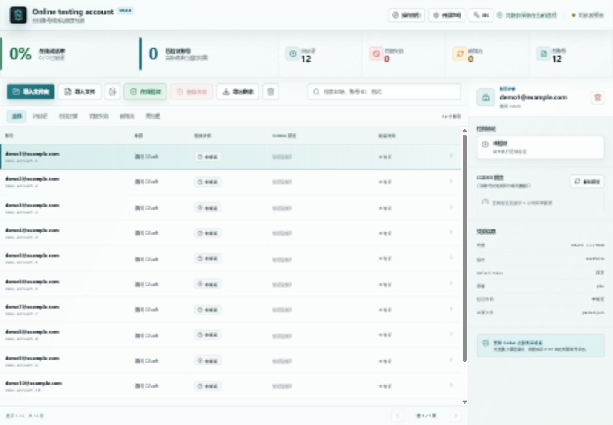
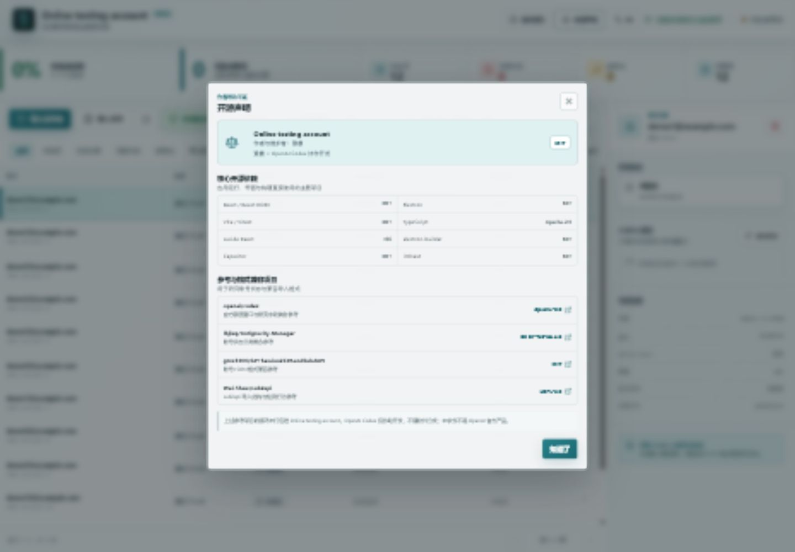

<p align="center">
  
</p>

<h1 align="center">Online testing account</h1>

<p align="center">
  Windows / Android 账号成活与 Codex 额度检测工具<br>
  作者：豫晨
</p>

<p align="center">
  <a href="README.md">中文</a> · <a href="README.en.md">English</a> ·
  <a href="https://github.com/nhzhongguo/online-testing-account/releases">Releases</a>
</p>

> [!IMPORTANT]
> 软件判断账号状态时会发送最小化的实际上游请求，不是根据 JSON 中的过期时间做本地推测。检测前必须开启国外 IP / 代理；中国大陆出口或 IP 所在国无法确认时，软件会阻止在线验证。

## 界面预览





> 上图来自开发过程，旧名 `Account Pulse` 已在 `v0.8.0` 更名为 `Online testing account`，并换用新图标。

## 主要功能

- 实际在线验证：OAuth 账号请求 Codex 上游，API Key 请求 OpenAI 模型列表。
- 国外 IP 前置检查：优先使用 Cloudflare Trace，失败时回退到 `country.is`。
- Codex 额度：显示 5 小时和周期窗口的剩余百分比及重置时间。
- 文件与文件夹导入：Windows 可递归导入整个文件夹，也可导入一个或多个 JSON。
- 大批量处理：分批解析、延迟搜索、100 条分页和批量状态合并，已针对 80,500 个账号的导入场景优化。
- 精确清理：只删除在线验证返回 HTTP 401 的凭据。
- 安全导出：限流、无权限、网络失败和未验证账号会被保留，可导出为可再次导入的 sub2api JSON。
- 中英文切换：界面语言保存在本地，重启后继续使用上次选择。
- 六步操作指引、开源声明、启动动画和新应用图标。
- Windows 桌面安装包与 Android APK。

## 下载与安装

请从 [GitHub Releases](https://github.com/nhzhongguo/online-testing-account/releases) 下载当前版本。

### Windows

1. 下载 `Online.testing.account.Setup.0.8.0.exe`。
2. 运行安装程序，可自定义安装目录。
3. 首次运行如果 Windows 显示未知发布者，请先核对 Release 中的 SHA-256；当前开源版本未使用商业代码签名证书。

### Android

1. 下载 `online-testing-account-v0.8.0-android.apk`。
2. 允许浏览器或文件管理器安装未知来源应用。
3. 安装 APK。Android 7.0（API 24）及以上受支持。

Windows 安装包和 Android APK 都由同一仓库源码构建。iOS 需要 macOS 与 Apple 签名环境，本次不提供。

## 使用方法

1. 先开启能够使用的国外代理或 VPN。
2. 点击“导入文件夹”或“导入文件”，也可粘贴 JSON。
3. 用搜索和状态筛选确认导入结果。
4. 点击“在线验证”。软件会先检测出口 IP，只有检测到非中国大陆出口时才能继续。
5. 选择“本批 25 个”或“全部待验证账号”开始实际请求。
6. 点击账号查看完整结论、HTTP 状态、额度和重置时间。
7. 如需清理，点击“删除失效”。该操作只针对 401，不会删除其他失败状态。
8. 点击“导出剩余”保存其余账号。Android 会打开系统分享/保存面板。

## 支持的账号格式

| 格式 | 识别内容 | 检测方式 |
| --- | --- | --- |
| Codex / ChatGPT Session / sub2api | OAuth access token、refresh token、account ID、client ID | Codex 最小模型请求 + usage 额度接口 |
| CPA / 9router / AxonHub / Codex-Manager | 兼容的 OAuth 字段和嵌套结构 | 归一化后执行 Codex 实际验证 |
| OpenAI API Key | `sk-...` 密钥 | `GET https://api.openai.com/v1/models` |
| 通用 OAuth | 可识别的 access token / refresh token 字段 | Codex 实际验证 |

导入器会遍历数组、对象及常见嵌套字段，并按凭据指纹合并重复项。单个文件上限为 10 MB；Windows 单次文件夹导入上限为 10,000 个 JSON。

## 状态含义

| 界面状态 | 典型响应 | 是否删除 |
| --- | --- | --- |
| 在线正常 | HTTP 2xx | 保留 |
| 凭据失效 | HTTP 401，或 refresh token 明确失效 | 可由“删除失效”删除 |
| 无权限 | HTTP 403 | 保留 |
| 被限流 | HTTP 429 | 保留，稍后可重试 |
| 服务异常 | 其他非 2xx HTTP | 保留 |
| 网络失败 | 超时、断网、代理不可用 | 保留 |
| 未验证 | 尚未发送实际请求 | 保留 |

本地 `expires_at` 只用于判断是否需要尝试刷新 access token，不作为最终成活结论。

## 额度说明

OAuth 账号在成功响应后，应用会从 Codex 响应头和 usage 响应中解析：

- `primary_window`：通常是 5 小时窗口。
- `secondary_window`：通常是周期窗口。
- `used_percent`：已使用百分比，界面显示 `100 - used_percent` 作为剩余额度。
- `reset_at` / `reset_after_seconds`：用于显示重置倒计时。

额度字段由上游服务决定，不是所有账号或响应都会提供。

## 隐私与安全

- 账号 JSON 只在当前应用进程中解析，不会上传到本项目的自建服务器。
- 在线验证必须将凭据发送给对应的 OpenAI / ChatGPT 上游端点，否则无法判断实际状态。
- Windows 请求由 Electron 主进程发送；Android 请求由 Capacitor 原生 HTTP 层发送。
- 日志、截图、测试和 Git 仓库不应包含 access token、refresh token 或完整账号文件。
- 仅测试你自己拥有或被明确授权管理的账号。

发现安全问题请查看 [SECURITY.md](SECURITY.md)。

## 本地开发

需求：Node.js 20+（当前构建使用 Node.js 24）、npm。Windows 安装包需 Windows；Android APK 需 JDK 21 和 Android SDK 36。

```powershell
npm install
npm run dev
```

仅运行浏览器预览：

```powershell
npm run dev:web
```

质量检查：

```powershell
npm test
npm run lint
npm run build
```

构建 Windows NSIS 安装包：

```powershell
npm run package:win
```

构建 Android APK：

```powershell
# 首次需在 android/local.properties 中设置本机 sdk.dir
npm run package:android
```

APK 输出位置：`android/app/build/outputs/apk/debug/app-debug.apk`。

## 架构

```text
src/
  App.tsx                    界面、导入、状态、批量验证流程
  i18n.ts                    中英文资源和语言持久化
  lib/accounts.ts            JSON 格式归一化、去重和导出
  lib/mobile-validator.ts    Android 原生 HTTP 验证与 IP 检查
electron/
  main.cjs                   Windows 窗口、文件夹导入和安全 IPC
  credential-validator.cjs  Windows 上游实际验证
  network-check.cjs         Windows 出口 IP 检查
android/                     Capacitor Android 原生工程
assets/app-icon.svg          应用图标矢量源文件
```

## 内容来源与开源声明

Online testing account 为独立实现，本仓库不包含下列参考项目的源码副本。它们用于研究状态分类、账号 JSON 格式和 Codex 额度字段：

| 项目 | 用途 | 许可证 |
| --- | --- | --- |
| [openai/codex](https://github.com/openai/codex) | Codex 请求形式、额度窗口和限流字段参考 | Apache-2.0 |
| [lbjlaq/Antigravity-Manager](https://github.com/lbjlaq/Antigravity-Manager) | 账号状态分类概念参考 | CC BY-NC-SA 4.0 |
| [gtxx3600/GPTSession2CPAandSub2API](https://github.com/gtxx3600/GPTSession2CPAandSub2API) | ChatGPT Session / CPA / sub2api JSON 兼容参考 | MIT |
| [Wei-Shaw/sub2api](https://github.com/Wei-Shaw/sub2api) | sub2api 结构与检测行为参考 | LGPL-3.0 |

直接依赖包括 React、Electron、Vite、TypeScript、Lucide、i18next、Capacitor 和 electron-builder；完整列表见 `package.json` 与 [THIRD_PARTY_NOTICES.md](THIRD_PARTY_NOTICES.md)。

OpenAI Codex 协助了本项目的开发，但不随应用分发。本项目不是 OpenAI 官方产品，也不代表上述参考项目对本应用的背书。

## 许可证

本项目自有源码使用 [MIT License](LICENSE)。第三方项目和依赖仍分别适用各自的许可证。
